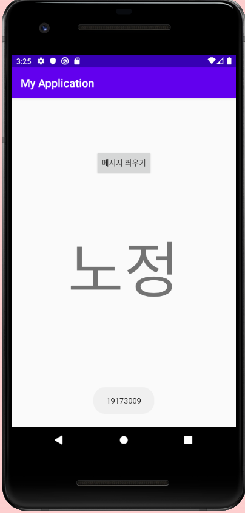
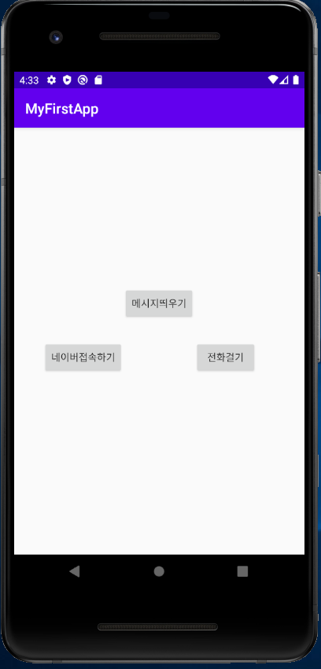
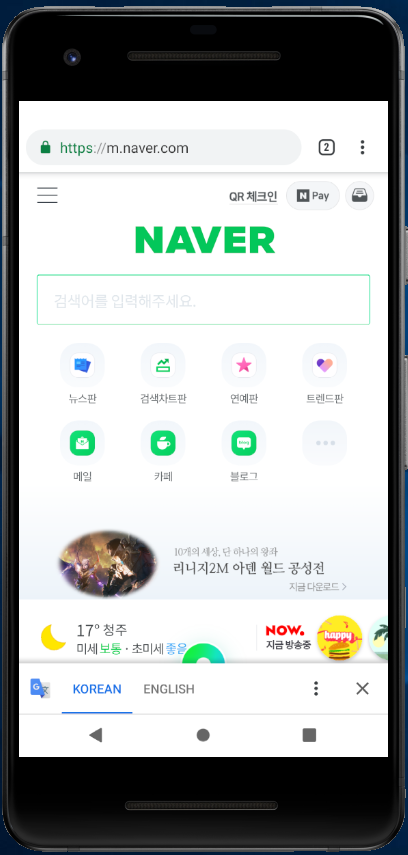
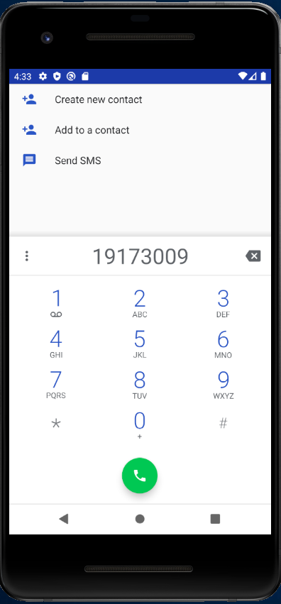
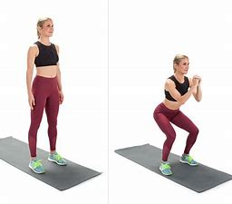
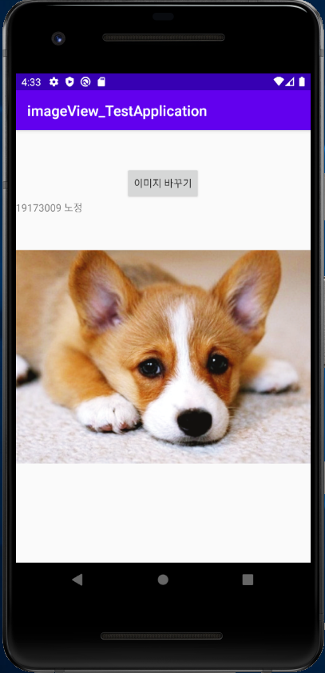
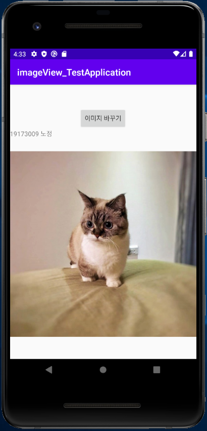

# MyFirstRepository
#19173009 노정

**##2주차 과제물**

</img>

**##3주차 과제물**

</img>
</img>
</img>

**##4주차 과제물**

    운동,식단을 커뮤니티 집단과 소통하는 앱
    
</img>
</img>

건강에 대한 관심이 높아지면서 운동을 하는 사람들이 많아지는 것을 주변에서 쉽게 찾을 수 있다.

자신의 운동영상과 식단사진을 관심사가 같은 사람들끼리 공유하게 되면

스스로에게 동기부여가 되고 만족감을 느낄 수 있게 될 것이다.

또한 매일매일 올라오는 동영상 또는 사진들을 보면서

상대방의 커뮤니티에 댓글을 남길 수 있어 소통하는 즐거움 까지 더해질 수 있다.

모르는 지식은 집단에게서 그 답을 구할 수 있고

자신이 누군가에게 지식을 알려줄 수 있는 서로 도움이 되는 앱을 개발 하고 싶다.

  **##7주차 과제물**
  
  </img>
  </img>
